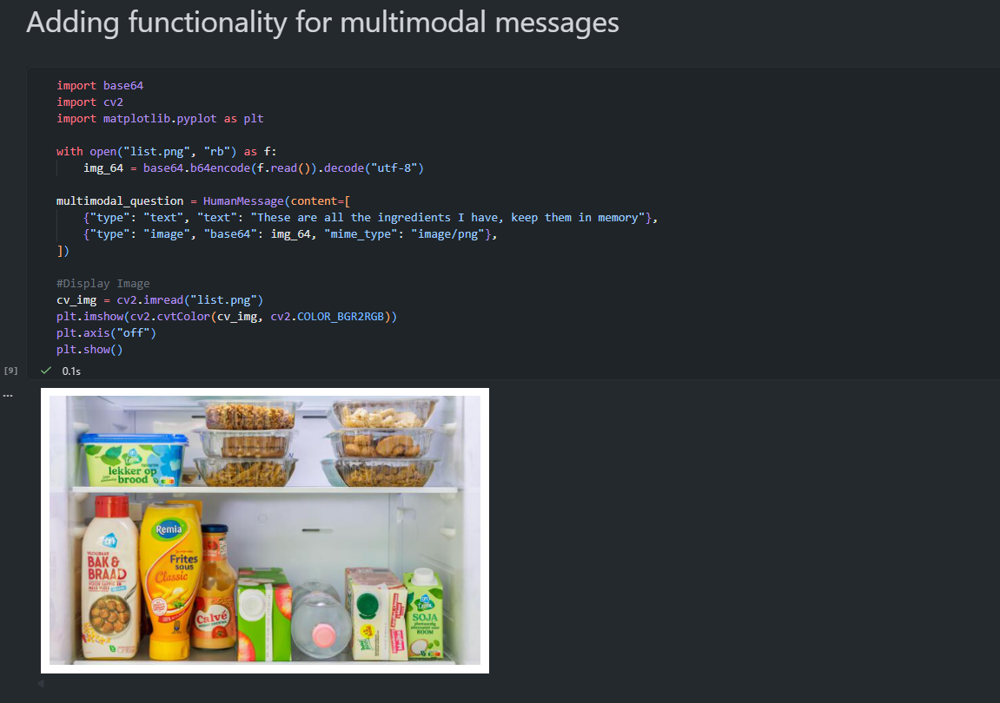
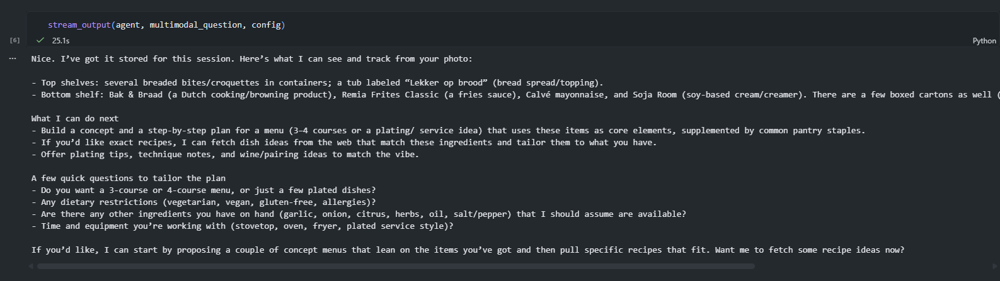
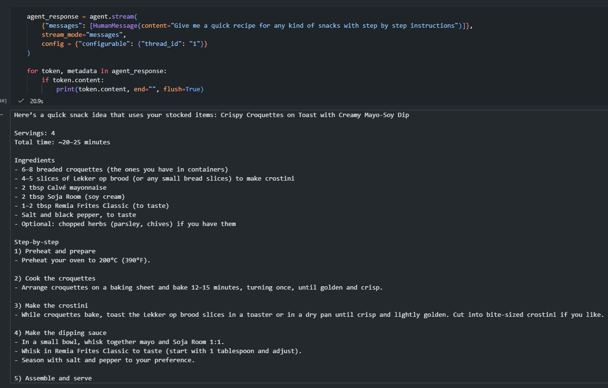

# Personal Chef Agent

A `multimodal` with `memory` personalised Chef Agent. Built using:
- [GPT-5-Nano](https://developers.openai.com/api/docs/models/gpt-5-nano)
- [LangChain](https://github.com/langchain-ai/langchain)

# Prerequisites

- [UV](https://docs.astral.sh/uv/) package manager
- PNG that holds ingredient list is labeled as `list.png`
- Rename `example.env` to `.env` and fill in relevant `API` keys
- Basic knowledge of LangChain agents and Syntax

# Setup
- Clone the repo
- Setup `.env` file
- run `uv sync` to create the virtual and environment and install all the dependencies

# Syntax for Writing Messages to the Agents

```Python
user_msg = HumanMessage(content="This is an example message for the agent")

agent.invoke(
    "messages": [user_msg],
    config={"configurable": {"thread_id": "1"}}
)
```

- The `config` field is filled or used only when we have imported `InMemorySaver` because it handles the memory part of the agent
- We can use `HumanMessage` for user inputs. For more types of messages, check LangChain docs.
- To stream output we use `agent.stream` instead of `agent.invoke`

```Python
def stream_output(agent, user_msg, config: Dict[str, Dict[str, str]]):
    for token, metadata in agent.stream(
        {"messages": user_msg},
        config=config,
        stream_mode="messages"
    ):
        if token.content:
            print(token.content, end="", flush=True)
```
- A custom function to stream output with type hint for the `config` argument.

# Test run

- Image Loads -> Yes


- Agent Understands the image -> Yes


- Agent can generate a recipe -> Yes


